# uscc_test_data
This app helps USCC (united saints christian church) to keep a clean record of their service attendees and the respective data particularly
during this Covid-19 era. Safe Cloud storage, realtime updates and simplified user interface are among the many services that this app offers.

### See the documentation below

## [User Guide]() (Basics of USCC App)

* Pre-requirements

- Android device or an emulator running Naughat (API 23) and above
- Access to internet (required only when signing in or performing a data sync)

# 1.
Upon launching the app, the first thing that appears is a splash screen. It contains a randomly selected full screen [Image]() and a random [Text]() at the bottom.

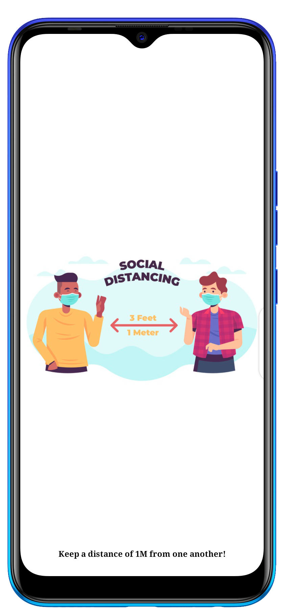

# 2.
After three seconds, the user is taken to a [viewpager]() that appears during the first run of the app or after clearing the app's data.

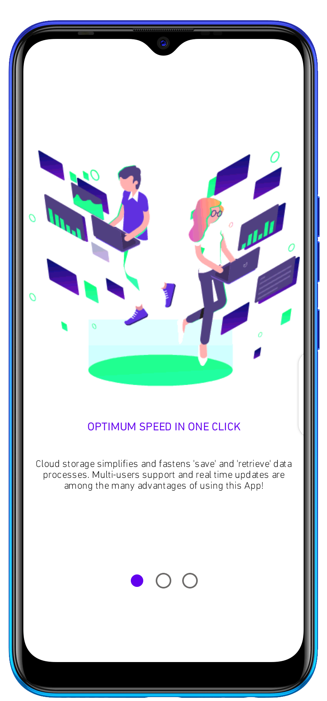  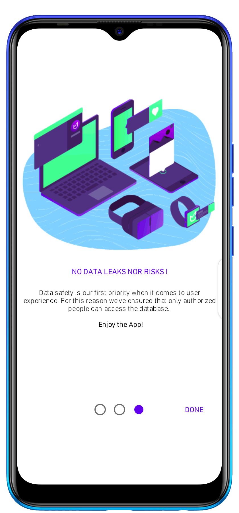

# 3.
In case the user had previously clicked the [done]() button (in the last page of the view pager) he's taken to the sign in screen/fragment. <b>NOTE</b> <i> All users share the same database meaning that there's no need of personal accounts. They just need to provide sign in details for the already created account (by the developer)</i>. 

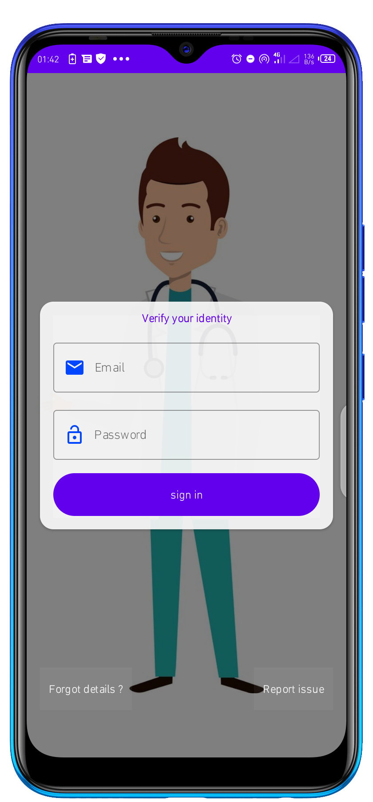

# 4. 

For a successful sign in all details must be filled correctly otherwise the respective errors are shown. If too many sign in failures are encountered,  all views are disabled for some time depending on the number of trials ie 30 sec for 5 trials, 60 sec for 10 trials and so on.

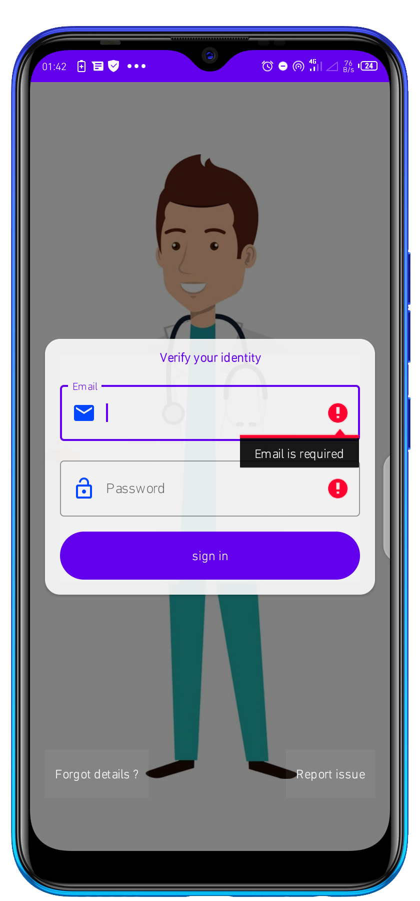	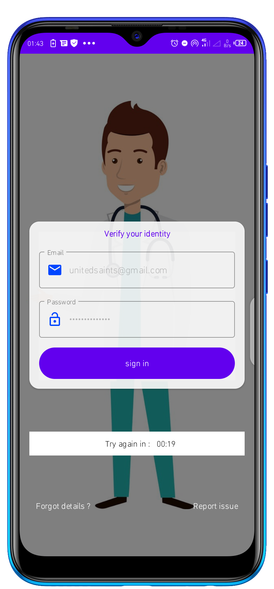

# 5.

You can also ask for help or report a sign in issue by clicking the respective button.

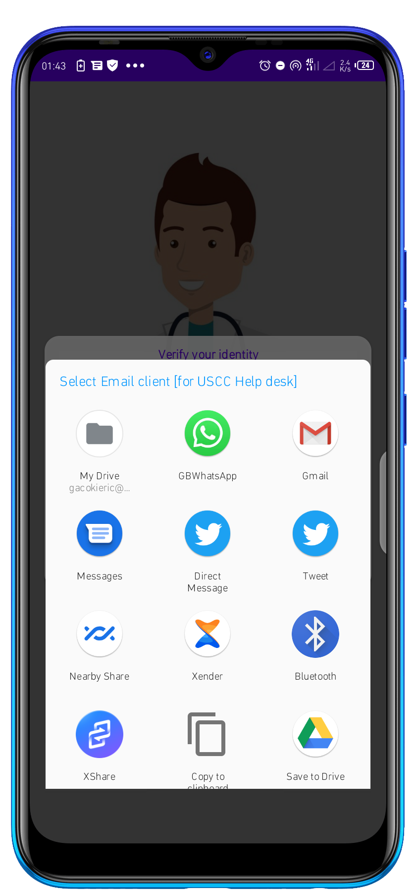 

# 6
## a. Home

Upon signing in successfully, Home screen opens up with an image and a text indicating no data has been saved yet. 
<b>NOTE</b> <u>In case other users had saved data into the database, it'll appear in your device as well because all users are sharing a data storage path. This is crusial as it defies the physical distance between the devices in use and real time updates and data syncing takes a very short time regardless of the number of users. All what you need to do is to stay online for the magic to happen.</u> 

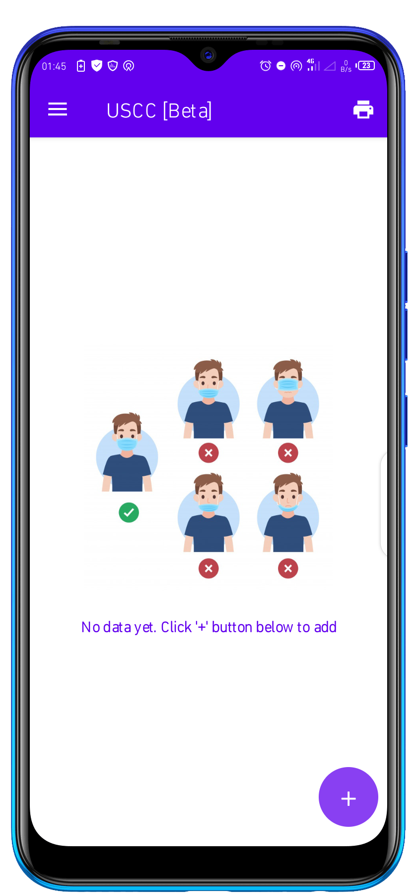 

## b. Permissions

This app requires several permissions for it to function properly. Just allow them all. (you can deny or allow them in app details as well)

## c. Buttons and their functionalities

* Main screen buttons

  - + button -> when clicked a bottomSheet appears in which the person data should be filled. All fields <b>must not</b> be empty before saving.

  - print icon (options menu button) - <i>intended to print the desired list of data.([currently under development]())</i>.

  - toogle button -> used to open or close the navigation drawer.

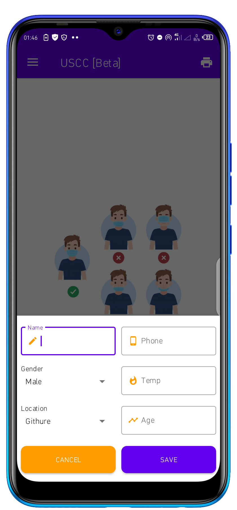 	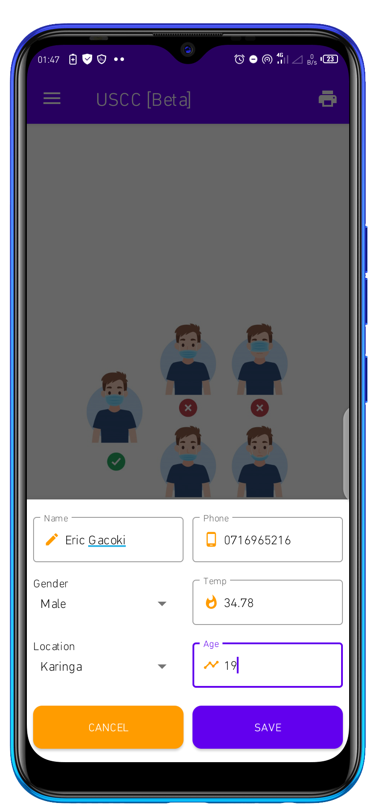	

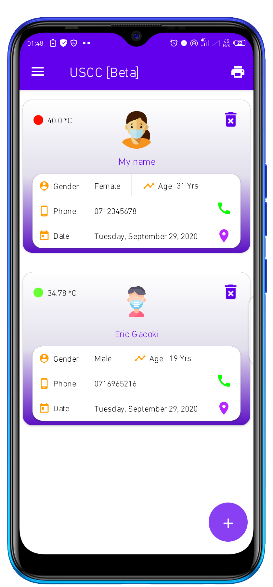	  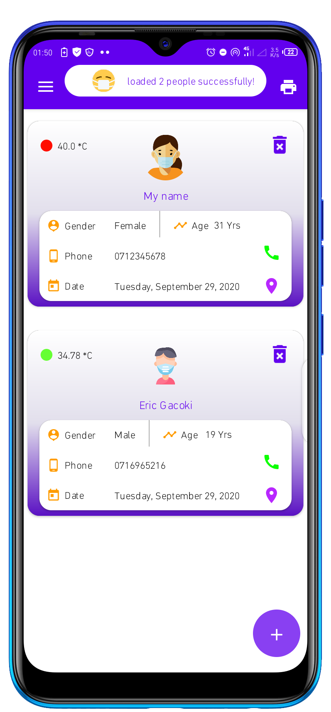

## d. Side Drawer

A user can perform four actions by using the navigation drawer

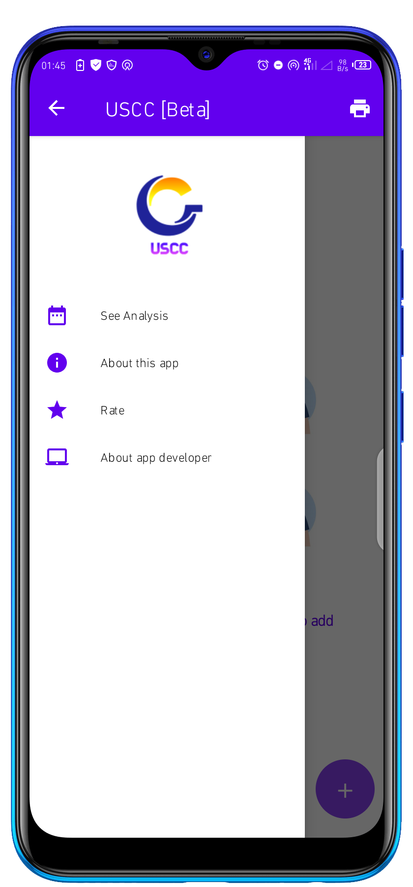		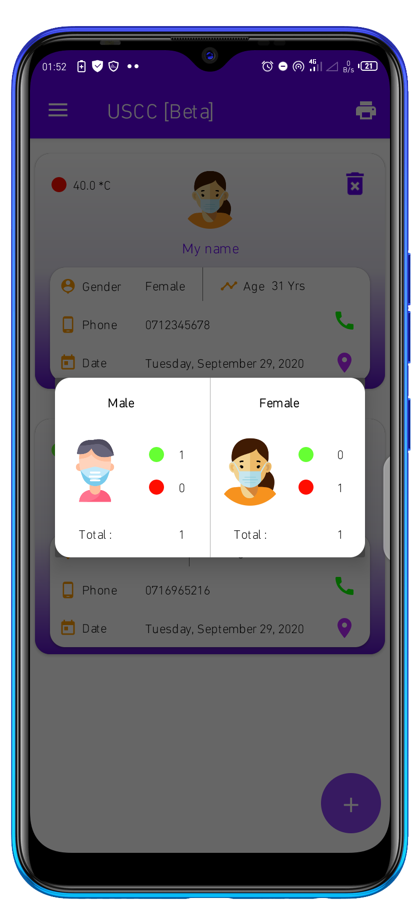

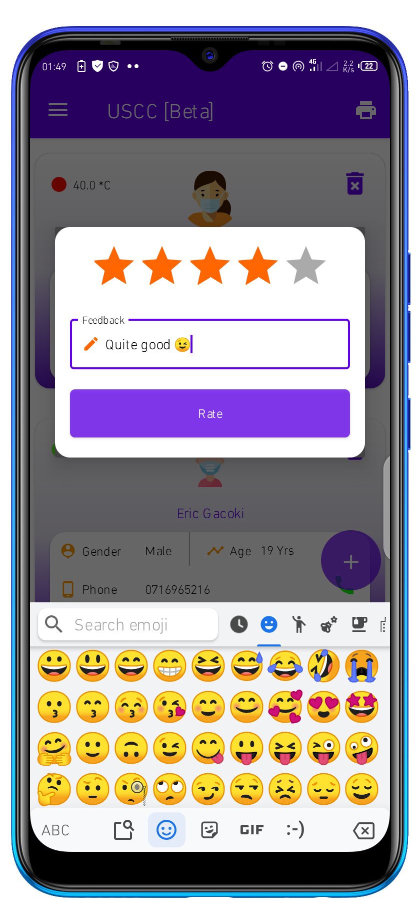 <...just to show a few>

As you've seen, every person's data saved appears in a card. The card contains three main buttons

## e. Card buttons

- delete -> deletes the current person

- call -> makes a call (directly without dialing) to the phone number provided for that person

- map -> utilizes the maps intents ie opens Google maps in navigation-view mode and tries to find the shortest path for differrent modes of transport between the current user and the location of the person under consideration. 

<b>NOTE</b> The current location is device-dependent but the destination is always the same.

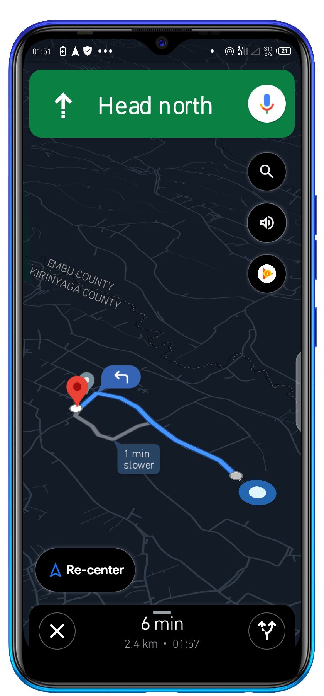

# [DEVELOPER GUIDE]() (Technical info about App UI and Backend)

## Tools and libraries

* Implements [Android Jetpack Components](https://developer.android.com/jetpack/) for instance: 
  - [Livedata]() - lifecycle-aware data holder class that exposes data changes to its observer 
  
  - [Databinding]() - Simplifies handling your app backend to the Front end (layouts)
  
  - [Navigation]() - Reduces the boilerplate code that was used to handle navigation and passing of data to destinations an dvice versa

* This App is written in 100% [Kotlin](https://kotlinlang.org/)

* Code style is achieved through [ktlint](https://github.com/pinterest/ktlint)

* [Kotlin coroutines](https://developer.android.com/kotlin/coroutines) - excecute code asyncronously with lightweight concurrency design pattern that is compatible with most of jetpack libraries

### Database and App security

* USCC App uses [Firebase firestore cloud storage](https://firebase.google.com/docs/firestore/quickstart)

<b>Database structure</b>

- the above code produces the structure below

* To ensure that only authorized users can access the app/database, USCC has implemented [Firebase Authentication](https://firebase.google.com/docs/auth)

### UI Design libraries

* [Material Design](https://material.io/develop/android)

  

* [Circle imageView](https://github.com/hdodenhof/CircleImageView)

 

* [Loading Views](https://github.com/ldoublem/LoadingView)

* [Gif Image View](https://github.com/koral--/android-gif-drawable)

